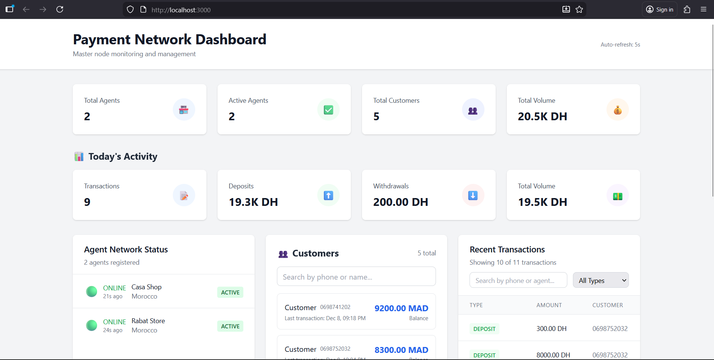
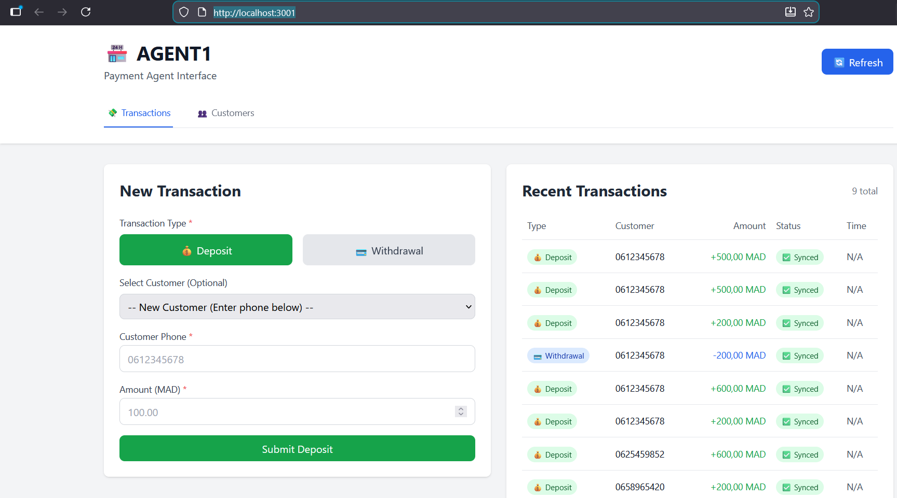
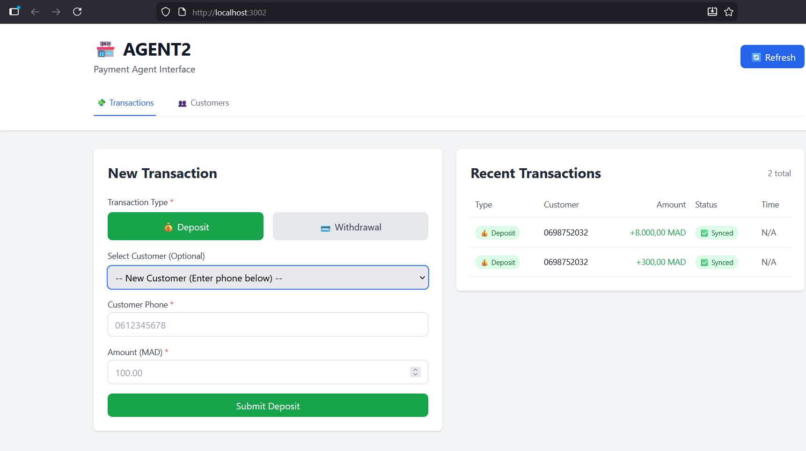
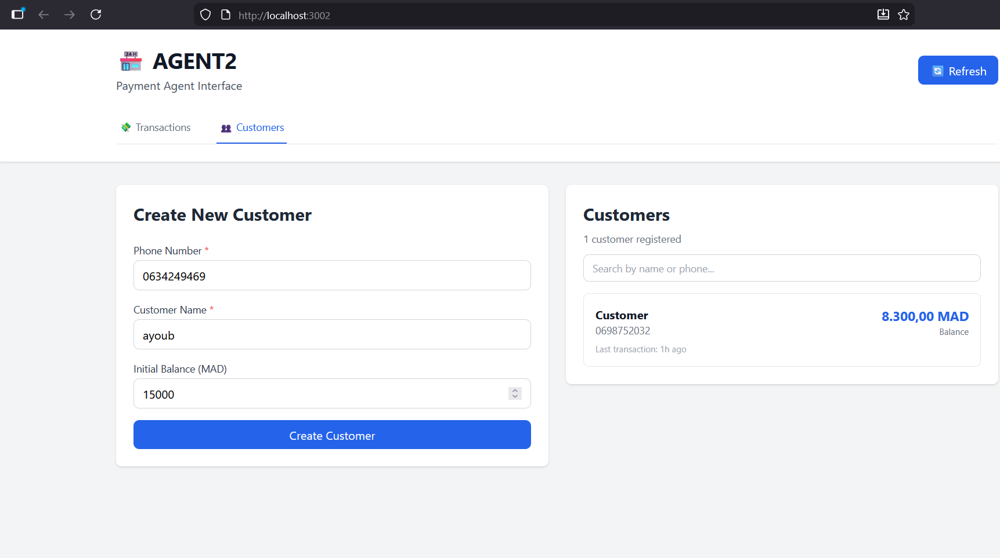

# Distributed Payment Network

A full-stack fintech application demonstrating a distributed agent-master payment system with real-time synchronization and conflict resolution.

## 📋 Table of Contents
- [Overview](#overview)
- [Features](#features)
- [Screenshots](#screenshots)
- [Architecture](#architecture)
- [Tech Stack](#tech-stack)
- [Getting Started](#getting-started)
- [Project Structure](#project-structure)

## 🎯 Overview

This project simulates a distributed payment network where multiple agents can process transactions independently, with automatic synchronization to a central master node. It demonstrates real-world fintech challenges including eventual consistency, conflict resolution, and real-time data synchronization.

## ✨ Features

### Master Dashboard
- **Real-time monitoring** of all agents, transactions, and system metrics
- **Agent management** with online/offline status detection
- **Customer overview** across all agents with balance tracking
- **Transaction history** with advanced filtering and search
- **Today's activity metrics** including deposits, withdrawals, and total volume
- **Auto-refresh** every 5 seconds for live updates

### Agent Interface
- **Transaction processing** for deposits and withdrawals
- **Customer management** with creation and balance tracking
- **Quick customer selection** via dropdown or dedicated management tab
- **Balance validation** to prevent insufficient fund withdrawals
- **Transaction history** for the local agent
- **Automatic synchronization** with master node every 30 seconds

### System Features
- **Distributed architecture** with agent-master synchronization
- **Conflict resolution** using last-write-wins strategy
- **Bidirectional sync** for transactions and customers
- **Customer auto-creation** during first transaction
- **Phone number validation** for Moroccan format (06/07)
- **Real-time balance updates** and transaction tracking

## 📸 Screenshots

### Master Dashboard - Overview

*Comprehensive view of all agents, customers, and real-time metrics including today's activity*

### Master Dashboard - Transaction History

*Complete transaction history with filtering by phone, agent, and transaction type*

### Agent Interface - Transaction Processing

*Process deposits and withdrawals with customer selection dropdown and balance display*

### Agent Interface - Customer Management

*Create and manage customers with search functionality and balance overview*

## 🏗️ Architecture

### System Design
```
┌─────────────────┐         ┌─────────────────┐         ┌─────────────────┐
│   Agent Node 1  │         │   Master Node   │         │   Agent Node 2  │
│                 │         │                 │         │                 │
│  - Transactions │◄───────►│  - Aggregation  │◄───────►│  - Transactions │
│  - Customers    │  Sync   │  - Monitoring   │  Sync   │  - Customers    │
│  - Local DB     │  30s    │  - Dashboard    │  30s    │  - Local DB     │
└─────────────────┘         └─────────────────┘         └─────────────────┘
```

### Key Components

**Spring Profiles:**
- `master` - Runs the master node with aggregation and monitoring
- `agent` - Runs agent nodes for transaction processing

**Synchronization:**
- Agents push pending transactions and all customers to master every 30 seconds
- Master receives, validates, and stores data with conflict resolution
- Last-write-wins strategy for handling concurrent updates
- Heartbeat mechanism for agent health monitoring

**Data Flow:**
1. Agent processes transaction locally
2. Transaction marked as PENDING_SYNC
3. Background scheduler pushes to master
4. Master validates and stores with SYNCED status
5. Master aggregates data for dashboard

## 🛠️ Tech Stack

### Backend
- **Java 17** - Modern Java features and performance
- **Spring Boot 3.x** - Enterprise-grade framework
- **Spring Data JPA** - Database abstraction with projections
- **Spring Profiles** - Environment-based configuration (master/agent)
- **H2 Database** - In-memory database (production-ready for PostgreSQL/MySQL)
- **Lombok** - Reduces boilerplate code
- **Maven** - Dependency management and build tool

### Frontend
- **React 18** - Modern UI library with hooks
- **TypeScript** - Type-safe JavaScript
- **Axios** - HTTP client for API integration
- **Custom Hooks** - Reusable logic for data fetching and state management
- **Feature-based Architecture** - Modular and scalable code organization
- **Tailwind CSS** - Utility-first CSS framework

### Key Patterns & Practices
- **Repository Pattern** - Clean data access layer
- **Service Layer** - Business logic separation
- **DTO Mapping** - API data transfer objects
- **Custom Hooks** - React state and side effects management
- **Polling Strategy** - Auto-refresh for real-time updates
- **Debouncing** - Optimized user input handling
- **Conflict Resolution** - Last-write-wins for distributed consistency

## 🚀 Getting Started

### Prerequisites
- Java 17 or higher
- Node.js 16+ and npm
- Maven 3.6+

### Running the Master Node

```bash
cd payment-network
mvn spring-boot:run -Dspring-boot.run.arguments=--app.role=master
```

The master node will start on `http://localhost:8080`

### Running an Agent Node

```bash
cd payment-network
mvn spring-boot:run -Dspring-boot.run.arguments=--app.role=agent,--server.port=8081,--agent.id=AGENT-001,--agent.name="Agent Casa",--agent.location="Casablanca"
```

The agent node will start on `http://localhost:8081`

### Running the Master Dashboard (React)

```bash
cd master-dashboard
npm install
npm start
```

Dashboard will open at `http://localhost:3000`

### Running the Agent Interface (React)

```bash
cd agent-interface
npm install
REACT_APP_AGENT_API_URL=http://localhost:8081 npm start
```

Agent interface will open at `http://localhost:3001`

## 📁 Project Structure

```
distributed-payment-network/
├── payment-network/              # Spring Boot backend
│   └── src/main/java/com/payment/
│       ├── agent/                # Agent-specific controllers & services
│       │   ├── customer/         # Customer management
│       │   ├── sync/             # Sync scheduler
│       │   └── transaction/      # Transaction processing
│       ├── master/               # Master-specific controllers & services
│       │   ├── agent/            # Agent registration
│       │   ├── customer/         # Customer aggregation
│       │   ├── dashboard/        # Dashboard metrics
│       │   └── sync/             # Sync receiver
│       └── shared/               # Shared entities & repositories
│           ├── domain/
│           │   ├── entity/       # JPA entities
│           │   └── repositories/ # Spring Data repositories
│           └── enums/            # Shared enumerations
│
├── master-dashboard/             # React master dashboard
│   └── src/
│       ├── features/
│       │   └── dashboard/
│       │       ├── components/   # Dashboard UI components
│       │       ├── hooks/        # Custom React hooks
│       │       ├── services/     # API services
│       │       ├── types/        # TypeScript types
│       │       └── utils/        # Helper functions
│       └── pages/                # Page components
│
└── agent-interface/              # React agent interface
    └── src/
        ├── features/
        │   ├── customer/         # Customer management feature
        │   │   ├── components/
        │   │   ├── hooks/
        │   │   ├── services/
        │   │   └── types/
        │   └── transaction/      # Transaction feature
        │       ├── components/
        │       ├── hooks/
        │       ├── services/
        │       └── types/
        └── pages/                # Page components
```

## 🔑 Key Implementation Details

### Backend Architecture

**Spring Profiles for Multi-Mode:**
```java
@ConditionalOnProperty(name = "app.role", havingValue = "master")
public class MasterSyncController { ... }

@ConditionalOnProperty(name = "app.role", havingValue = "agent")
public class AgentSyncScheduler { ... }
```

**DTO Projections for Optimized Queries:**
```java
public interface CustomerProjection {
    String getPhoneNumber();
    String getName();
    Double getBalance();
}
```

**Transaction Management:**
```java
@Transactional
public SyncResponse receiveTransactions(SyncRequest request) {
    // Atomic transaction processing with conflict resolution
}
```

### Frontend Architecture

**Custom Hooks for Data Management:**
```typescript
export const useTransactions = (refreshInterval: number) => {
  // Automatic polling with state management
  // Error handling and loading states
  // Transaction submission logic
}
```

**Feature-based Module Structure:**
```
features/
├── customer/           # Customer domain
│   ├── components/     # UI components
│   ├── hooks/          # Data fetching logic
│   ├── services/       # API calls
│   └── types/          # TypeScript interfaces
└── transaction/        # Transaction domain
    └── ...
```

## 🔐 Security Considerations

- API key authentication for agent-master communication
- Agent ID validation on sync requests
- Phone number format validation
- Balance validation before withdrawals
- Transaction isolation for data consistency

## 🚧 Future Enhancements

- PostgreSQL/MySQL for production deployment
- JWT authentication for web interfaces
- WebSocket for real-time updates
- Transaction rollback mechanism
- Multi-currency support
- Advanced reporting and analytics
- Agent performance metrics
- Audit logging

## 📝 License

This project is for demonstration purposes.

---

**Built with modern technologies and best practices for distributed systems**